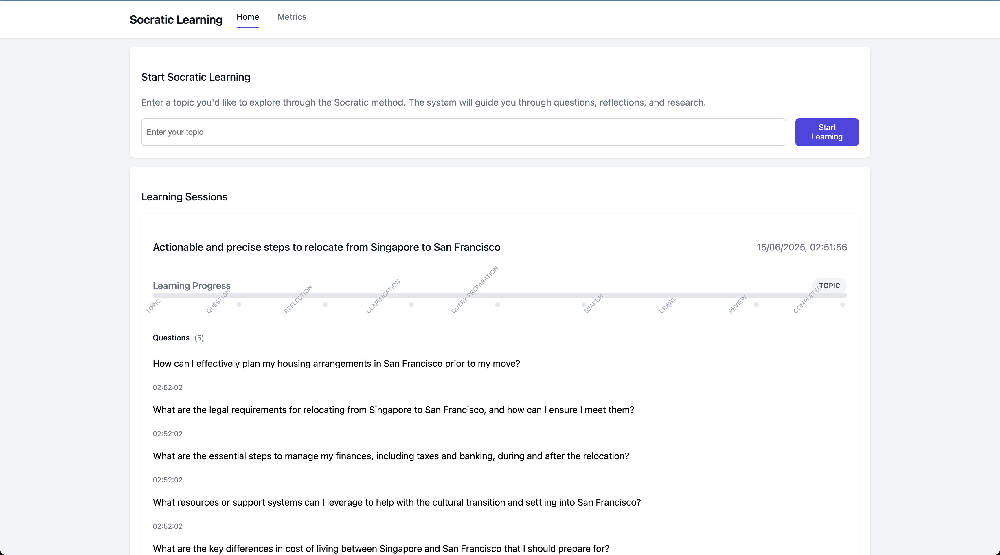

# Socratic Learning Platform

A modern learning platform that uses AI-driven Socratic questioning to deepen understanding and facilitate learning through structured dialogue.

## Demo




## Tech Stack

- **Runtime**: Node.js 18.x
- **Language**: TypeScript
- **Framework**: Serverless Framework v4
- **Database**: PostgreSQL 15
- **ORM**: TypeORM
- **AI**: LangChain with OpenAI
- **Search**: SerpApi for web search
- **Web Interface**: Express with EJS templates
- **Queue**: ElasticMQ (SQS compatible)
- **Monitoring**: Custom metrics dashboard
- **Type Safety**: Zod schemas
- **Storage**: AWS S3 for search results

## Project Structure

```
├── src/
│   ├── entities/        # TypeORM entities
│   │   ├── Topic.ts
│   │   ├── Question.ts
│   │   ├── Reflection.ts
│   │   ├── Clarification.ts
│   │   ├── QueryPreparation.ts
│   │   ├── SearchResult.ts
│   │   └── CrawlRequest.ts
│   ├── handlers/       # Queue handlers
│   │   ├── TopicHandler.ts
│   │   ├── QuestionHandler.ts
│   │   ├── ReflectionHandler.ts
│   │   ├── ClarificationHandler.ts
│   │   ├── QueryPreparationHandler.ts
│   │   └── SearchHandler.ts
│   ├── services/       # Core services
│   │   ├── OpenAIService.ts
│   │   ├── QueueService.ts
│   │   ├── LoggerService.ts
│   │   ├── MonitoringService.ts
│   │   ├── SerpApiService.ts
│   │   └── FireCrawlService.ts
│   ├── web/           # Web interface
│   │   ├── routes/
│   │   ├── views/
│   │   └── public/
│   ├── config/        # Configuration
│   ├── types/         # TypeScript types
│   └── utils/         # Utility functions
├── queue-config/      # Queue configuration
├── serverless.yml     # Serverless config
└── docker-compose.yml # Docker services
```

## Features

### AI-Driven Learning
- Structured Socratic questioning using OpenAI
- Type-safe AI responses with Zod schemas
- Progressive learning paths
- Automated follow-up questions

### Web Search & Content Analysis
- Intelligent web search using SerpApi
- Content crawling and analysis
- S3 storage for search results
- Webhook integration for async processing

### Web Interface
- Real-time metrics dashboard
- Queue monitoring
- Learning progress visualization
- Interactive learning sessions

### Processing Pipeline
1. **Topic Creation**: Initial learning topics
2. **Question Generation**: AI-driven Socratic questions
3. **Reflection Analysis**: Understanding assessment
4. **Clarification**: Targeted follow-up questions
5. **Query Preparation**: Research guidance
6. **Search**: Web content discovery
7. **Crawl**: Deep content analysis

### Type Safety
- Zod schemas for AI responses
- TypeScript throughout
- Runtime validation
- Structured data flow

## Getting Started

1. **Clone and Install**
```bash
git clone <repository-url>
cd <project-directory>
npm install
```

2. **Environment Setup**
Create a `.env` file:
```env
# API Keys
OPENAI_API_KEY=your_openai_api_key
SERP_API_KEY=your_serpapi_key
FIRECRAWL_API_KEY=your_firecrawl_key

# Database
POSTGRES_HOST=localhost
POSTGRES_PORT=5432
POSTGRES_DB=myapp
POSTGRES_USER=postgres
POSTGRES_PASSWORD=postgres

# AWS Configuration
AWS_REGION=us-east-1
S3_BUCKET=your-bucket-name

# Queue Configuration
QUEUE_ENDPOINT=http://localhost:9324
QUEUE_REGION=elasticmq
QUEUE_ACCESS_KEY_ID=root
QUEUE_SECRET_ACCESS_KEY=root

# Webhook Configuration
FC_WEBHOOK=your_webhook_url
```

3. **Start Services**
```bash
# Start core services
npm run dev

# Expose webhook endpoint (in a separate terminal)
npm run expose:webhook
```

## Development Scripts

- **Core Commands**
  - `npm run dev` - Start all services
  - `npm run build` - Build TypeScript
  - `npm run start` - Start Serverless offline

- **Service Management**
  - `npm run services:up` - Start Docker services
  - `npm run services:down` - Stop services
  - `npm run services:clean` - Clean volumes

- **Webhook Development**
  - `npm run expose:webhook` - Expose local webhook endpoint via ngrok

## Webhook Setup

The platform uses webhooks for asynchronous processing of crawled content. To set up webhooks:

1. Start your local server:
```bash
npm run dev
```

2. In a separate terminal, expose your webhook endpoint:
```bash
npm run expose:webhook
```

3. Use the generated ngrok URL as your webhook endpoint in the SerpApi dashboard

The webhook endpoint will receive crawl results and process them automatically.

## Monitoring

The platform includes a web-based monitoring dashboard at `/metrics` showing:
- Queue depths and processing rates
- Error rates and types
- Processing times
- Learning progress metrics
- Search and crawl statistics

## Production Deployment

Before deploying:
1. Configure proper AWS credentials
2. Set up production database
3. Configure API keys (OpenAI, SerpApi, FireCrawl)
4. Review resource allocations
5. Set up monitoring alerts
6. Configure production webhook endpoints

## Contributing

1. Fork the repository
2. Create a feature branch
3. Make your changes
4. Submit a pull request

## License

ISC License 